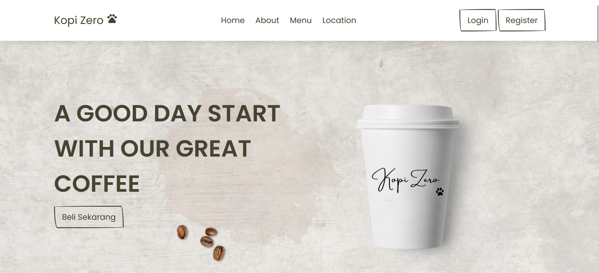
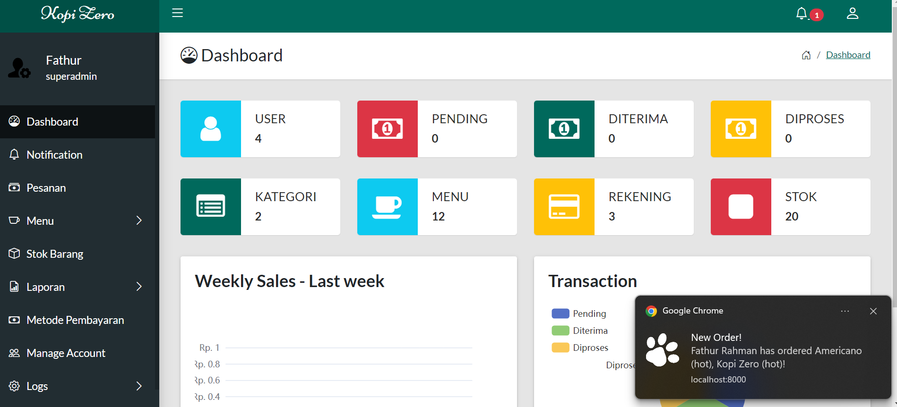
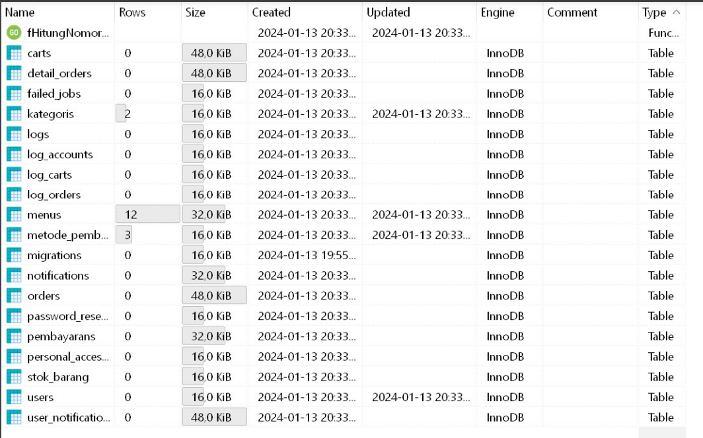

<h1 style="color:blue">Website Coffee Shop Kopi Zero With Laravel 10 Vanila CSS</h1>

[For Full ScreenShot and Feature Click Me](https://geode-pea-abb.notion.site/Coffee-Shop-Kopi-Zero-7175b4b3873748c79fd34f50f05e86b0)

<h3>Front End Responsive</h3>

<h3>Back End Realtime Notification</h3>

<h3>Database Tables</h3>

<h2 style="color:cyan">Installation</h2>
<ul>
    <li>Clone the Repo:   </li>
    <li style=""> > git clone https://github.com/faman272/coffee_shop_kopizero.git</li>
    <li> > cd coffee_shop_kopizero</li>
    <li> > composer update or composer install</li>
    <li> > create database with name "kopi_zero" or Import .sql file "KopiZero.sql"</li>
    <li> > php artisan key:generate</li>
    <li> > php artisan storage:link</li>
    <li> > php artisan migrate:fresh --seed</li>
    <li> > php artisan db:seed</li>
    <li> > php artisan serve</li>
    <li> <a href="http://127.0.0.1:8000/">http://127.0.0.1:8000/</a> </li>
</ul>

<h3>Kelompok 1 MSBD</h3>
- Admin: admin@gmail.com , password: admin 
   
[For Full ScreenShot and Feature Click Me](https://geode-pea-abb.notion.site/Coffee-Shop-Kopi-Zero-7175b4b3873748c79fd34f50f05e86b0)

